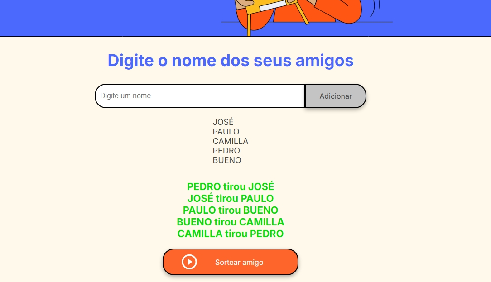

# projeto-amigosecreto
#Amigo Secreto App

Este projeto é um aplicativo simples para organizar um sorteio de amigo secreto. Ele permite que você adicione nomes, embaralhe os participantes e exiba os pares sorteados de maneira intuitiva.

##Funcionalidades

1.Adicionar Participantes: 
   *Os nomes dos participantes podem ser adicionados através de um campo de entrada.
   *Validação para evitar nomes duplicados ou campos vazios.

 

2. Sorteio de Amigo Secreto:
   *O sorteio garante que cada participante tenha um amigo secreto único.
   *Utiliza um algoritmo de embaralhamento para gerar os pares.
 
3. Exibição dos Resultados:
  *Os pares sorteados são exibidos na tela de forma clara e organizada.

 

##Tecnologias Utilizadas
 >*HTML5: Estrutura do aplicativo.
 >*CSS3: Estilização responsiva e atraente.
 >*JavaScript: Lógica para adicionar participantes, realizar o sorteio e exibir os resultados.

##Como Usar

Clone o repositório:

~~~
git clone https://github.com/guilhermesilvacorreia/projeto-amigosecreto.git 
~~~
 

Navegue até o diretório do projeto:

  'cd amigo-secreto-app'

Abra o arquivo index.html em qualquer navegador moderno:

 > start index.html 

##Siga os passos:

-Digite o nome dos participantes no campo de entrada e clique em Adicionar.

-Depois de adicionar todos os participantes, clique em Sortear Amigo.

-Veja os pares sorteados na tela.

## Estrutura do Projeto

.
* index.html          * Estrutura principal do aplicativo
* style.css           * Estilos para a interface do usuário
* app.js              * Lógica de sorteio e interações
* assets/             * Imagens e ícones usados no aplicativo
*README.md           * Documentação do projeto

##Personalizações
*Estilos: Altere o arquivo style.css para modificar a aparência.
*Lógica de Sorteio: Modifique o arquivo app.js para adicionar regras personalizadas.

